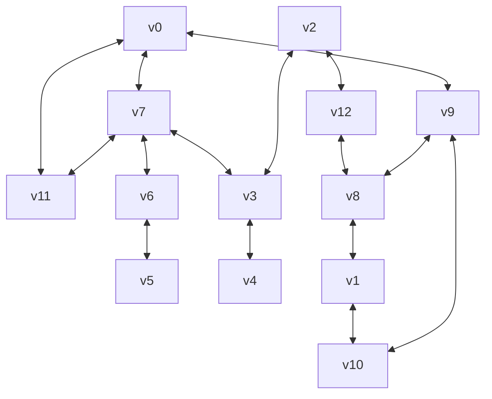

# BreadthFirstFunctional
Simple breadth first graph search using adjacency list.

See https://youtu.be/09_LlHjoEiY that covers this topic
Github for the tutorial https://github.com/williamfiset/algorithms
Java implemenation from the github https://github.com/williamfiset/Algorithms/blob/master/src/main/java/com/williamfiset/algorithms/graphtheory/BreadthFirstSearchAdjacencyListIterative.java

## Tests

Run the tests with `npm test`

### Simple Graph For Tests

  

   
Diagram created with mermaid cli, click to show

  
### Generated Mermaid Diagram (using CLI)

### Silly CLI

